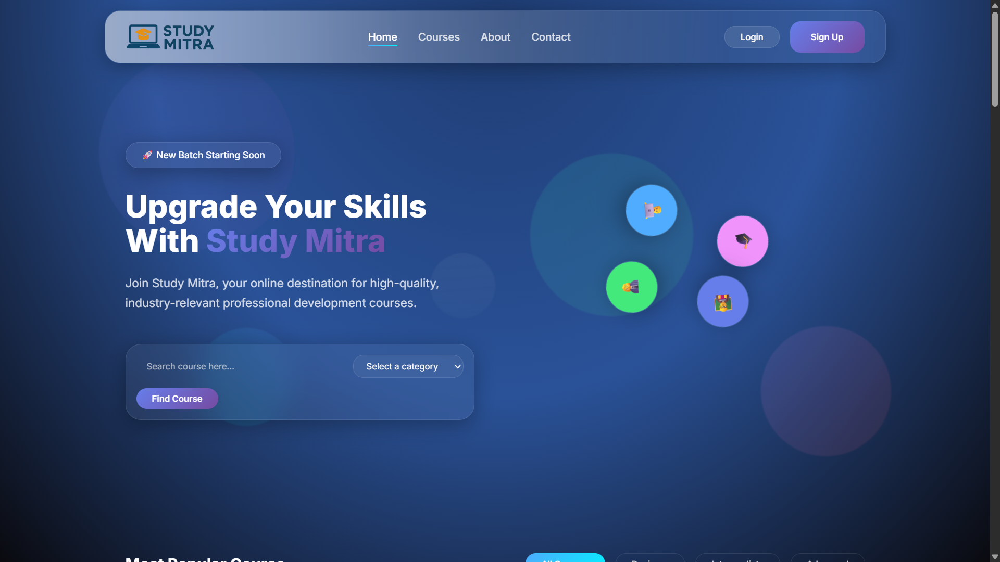

# Study Mitra - Responsive Landing Page

A modern, responsivdern, rng page for Study Mitra, an IT education platform built with liquid glass morphism design.

## 🌟 Preview



## ✨ Featur

### De Design
- **Liquid Glass Morphism Theme** - Modern frosted glass effects with backdrop blur
- **Responsive Design** - Mobile-first approach that works on all devices
- **White Gradient Navigation** - Striking gradient effect on the navbar
- **Animated Background** - Floating shapes with smooth animations
- **Professional Color Scheme** - Mix of dark glass morphism and clean white sections

### 📱 Pages
- **Home Page** - Hero section with course preview and statistics
- **About Page** - Company story, mission, team, and achievements
- **Courses Page** - Complete course catalog with filtering system
- **Contact Page** - Contact methods, interactive form, and FAQ

### 🚀 Interactive Elements
- **Course Filtering** - Filter courses by category
- **FAQ Accordion** - Expandable question sections
- **Contact Form** - Fully functional with validation
- **Smooth Scrolling** - Navigation with smooth scroll effects
- **Hover Animations** - Beautiful hover effects throughout

### 💻 Technical Features
- **Pure HTML5, CSS3, JavaScript** - No external dependencies
- **CSS Custom Properties** - Consistent theming system
- **Mobile Responsive** - Breakpoints for mobile, tablet, and desktop
- **Performance Optimized** - GPU-aceleratted animations
- **Accessibility Compliant** - Proper ARIA labels and semantic markup

## 🛠️ Technologies Used

- **HTML5** - Semantic markup structure
- **CSS3** - Advanced styling with custom properties, flexbox, and grid
- **JavaSca JavaScript** - DOM manipulation and interactive features
- **Google Fonts** - Inter font family for modern typography

## 📂 Project Structure

```
├── indetratml          # Home page
├── about.html          # About page
├── courses.html        # Courses page
├── contact.html        # Contact page
├── style.css           # Main stylesheet
├── script.js           # JavaScript functionality
├── logo study mitra.png # Company logo
├── preview.png         # Landing page preview
└── README.md           # Project documentation
```

## 🚀 Getting Started

1. **Clone or download** the project files
2. **Open a terminal** in the project directory
3. **Start a local server**:
   ```bash
   python -m http.server 8000
   ```
4. **Open your browser** and navigate to `http://localhost:8000`

## 📱 Responsive Breakpoints

- **Mobile**: 320px - 767px
- **Tablet**: 768px - 1023px
- **Desktop**: 1024px and above

## 🎯 Key Sections

### Home Page
- Hero section with animated avatars
- Popular courompanyowcase
- Course categories grid
- Statistics banner
- Latest courses section
- Transform learning experience
- Expert instructors

### About Page
- Mission and vision
- Company journey timeline
- Core te Sec
- Leadership team
- Achievement statistics

### Courses Page
- Course filtering system
- Detailed course cards
- Learning paths
- Comprehensive curriculum information

### Contact Page
- Multiple contact methods
- Interactive contact form
- FAQ accordion
- Call-to-action sections

## 🎨 Design System

### Colors
- **Primary**: Deep purple gradients (#667eea, #764ba2)
- **Secondary**: Pink gradients (#f093fb, #f5576c)
- **Accent**: Cyan gnts (#4facfe, #00f2fe)
- **Success**: Green gradients (#43e97b, #38f9d7)
- **Background**: Dark navy (#0a0a0f)
- **White**: Clean white sections for contrast

### Typography
- **Font Family**: Inter (Google Fonts)
- **Headings**: 700-800 weight
- **Body**: 400-500 weight
- **Responsive scaling** across all devices

## 🌟 Special Features

- **Glass Morphism Effects** - Frosted glass cards with backdrop blur
- **Floating Animations** - Background shapes with smooth movement
- **Gradient Text** - Beautiful gradient effects on headings
- **White Gradient Navbar** - Striking gradient effect on navigation
- **Smooth Transitions** - 60fps animations throughout
- **Interactive Forms** - Real-time validation and feedback

## 📧 Contact

For questions or support regarding this landing page, please use the contact form on the website or reach out through the provided contact methods.

---

**Study Mitra** - Transform Your Career with Premium IT Courses 🎓